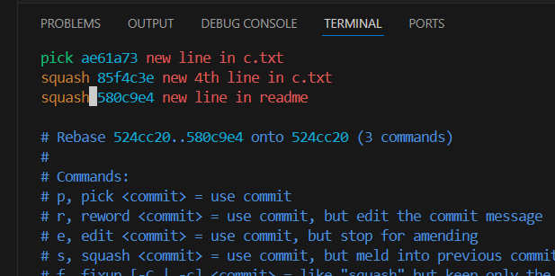
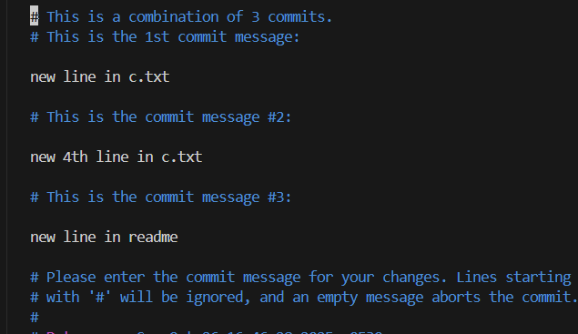
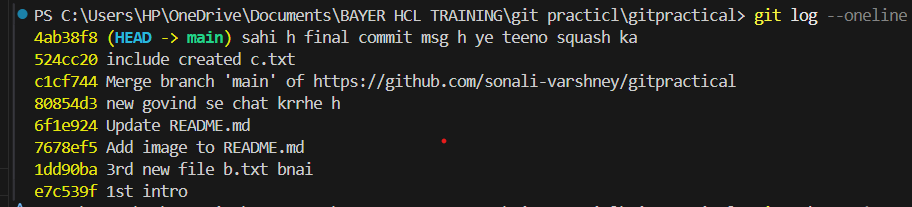
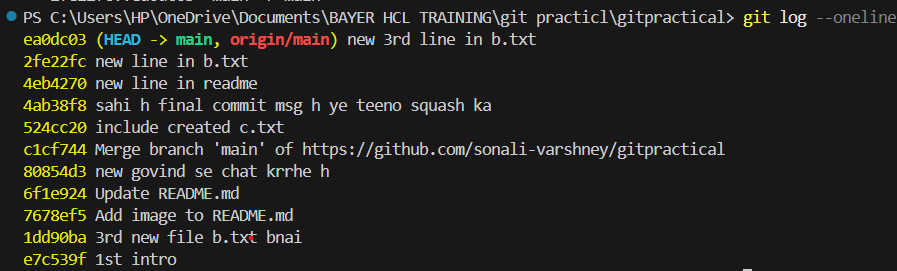

## git commit --amend


ye latest commit ko change krega
see amend krne se commit id bhi change ho gai

```bash
jha bhi commit history change hogi (github me  commit id 1 present h but locally vo coimmit id change ho kr commit id 2 ho gai.. ) so if we try to push it tpo github, using git push , it will throw error. so instead do "git push -f"  or "git push origin main --force"
```
## git squash








1 new commit id bn gai. yha bhi push krne k liye use "git push -f" or "git push origin main --force"

## git drop




change it to drop


## git cherry pick


